  

 

[Portfolio](https://shivambuilds.dev) · [LinkedIn](https://www.linkedin.com/in/crateis/) · [GitHub](https://github.com/LordCrateis)

I build lean, serverless data systems — **Polars** over Pandas, few-shot learning and anomaly detection where signal is scarce, and infra on **AWS Lambda** / **Azure Functions** that scales without the overhead.

### Builds

| | |
|---|---|
| **[NutriCore AI](https://nutricore.shivambuilds.dev)** | Gradient-boosted health prediction engine, served live via Flask on Hugging Face Spaces. |
| **Forty Minutes to Forever** | Titanic survival model wrapped in a branching interactive-fiction game — every choice doubles as a model feature. |
| **[Olist E-Commerce Analytics](https://github.com/LordCrateis/olist-ecommerce-analytics)** | SQL-driven EDA on 100k+ orders, a Polars notebook, and a 4-page Power BI dashboard. |
| **Asset & Vulnerability Scanner** | Passive recon via Shodan, active scanning via Nmap and Nuclei, with strict scope enforcement and PDF reporting. |

<b>Stack</b>

 

`Python` `C++` `JavaScript` &nbsp;·&nbsp; `Polars` `NumPy` `PostgreSQL` &nbsp;·&nbsp; `PyTorch` `scikit-learn` `Hugging Face` &nbsp;·&nbsp; `FastAPI` `Docker` `AWS Lambda` `Azure Functions` &nbsp;·&nbsp; `Nmap` `Shodan` `Nuclei`

### Activity

<picture>
  <source media="(prefers-color-scheme: dark)" srcset="https://raw.githubusercontent.com/LordCrateis/LordCrateis/output/snake-dark.svg" />
  <source media="(prefers-color-scheme: light)" srcset="https://raw.githubusercontent.com/LordCrateis/LordCrateis/output/snake-light.svg" />
  
</picture>

 

Efficiency is the foundation of freedom.

